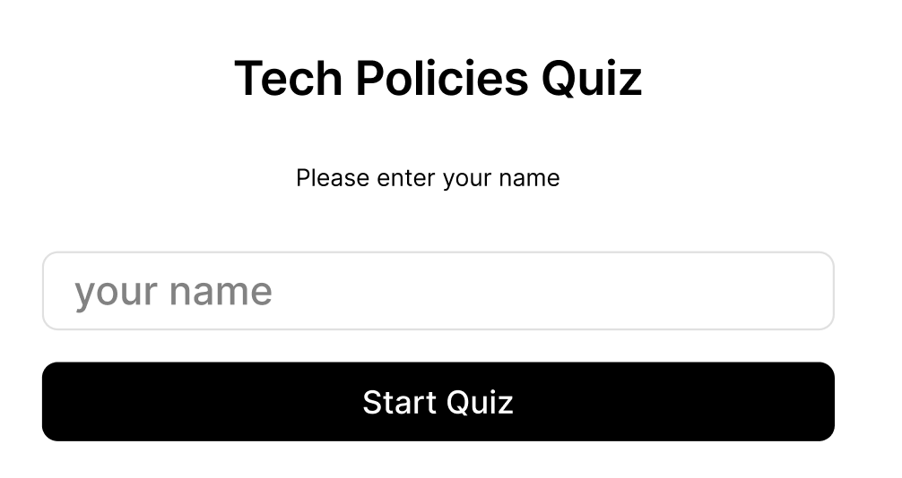
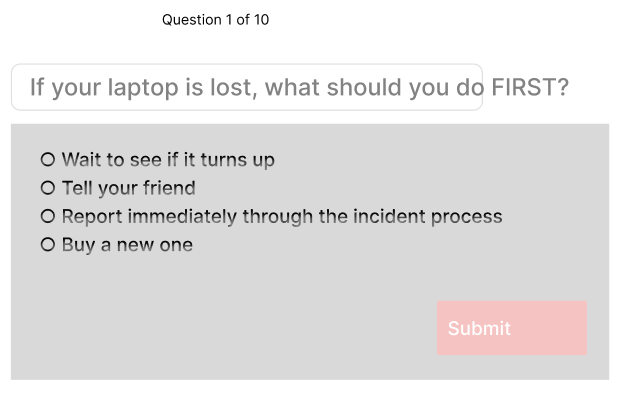
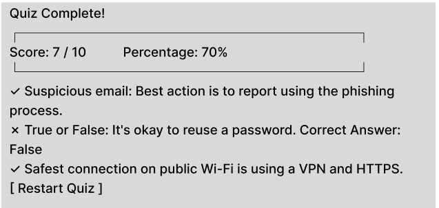
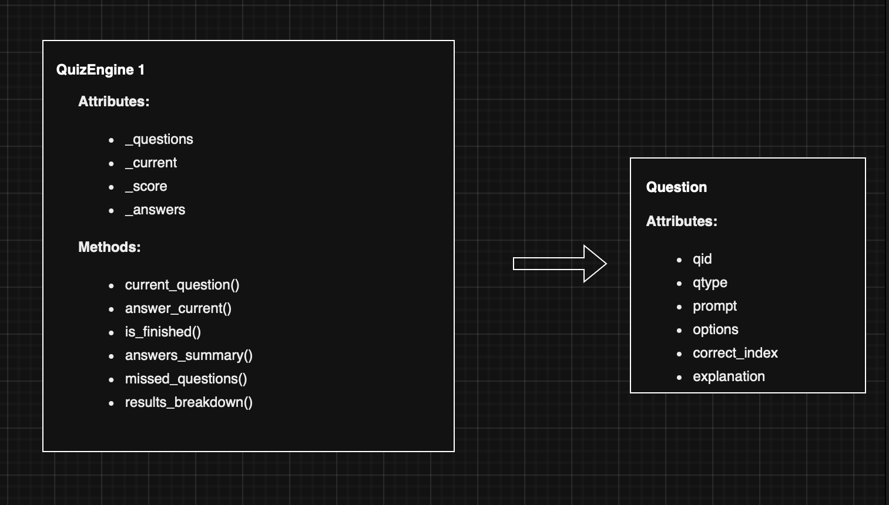
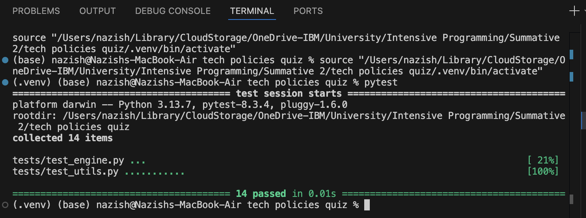

# Tech Policies Quiz (MVP)
This is a Python and Streamlit-based quiz designed to reinforce essential workplace technology and security policie for complaince and adherence.

## 1. Introduction
Modern technology workplaces rely heavily on employees understanding and following security, privacy and acceptable use policies. These policies help maintain the integrity of systems, protect sensitive information and prevent human errors that commonly lead to cyber incidents. However, in many organisations, staff encounter these policies only during onboarding, and awareness naturally decreases over time.
To address this gap, I have developed a Tech Policies Quiz MVP, which is a lightweight and interactive tool designed to help staff refresh their knowledge of key organisational policies. The quiz focuses on areas such as phishing awareness, password hygiene, incident reporting, data handling and secure connectivity practices things that all crucial in daily operations. The application provides a quick, non‑formal way to reinforce best practices while making compliance learning more engaging.
From a development perspective, this project demonstrates a complete software lifecycle: design, planning, implementation, testing, deployment and documentation. The application uses Python and Streamlit for the GUI, incorporates object‑oriented programming principles, stores results in CSV format for persistence and includes both manual and automated testing. This aligns with professional development standards expected in junior software developer and technical apprentice roles.

## 2. Design Section
### 2.1 GUI Design (Figma Screenshots)
The interface was designed in Figma to plan the user journey before implementation. The prototype consists of three screens: the Start Screen, Question Screen and Results Screen.

#### Start Screen (Figma)

Users enter their name
Clearly displays the app title and input field
Single call‑to‑action button (“Start Quiz”)

Screenshot:

#### Question Screen (Figma)

Displays the question number
Shows the question text
Radio-style answer options
Submit button

Screenshot:

#### Results Screen (Figma)

Shows final score and percentage
Lists correct and incorrect answers
Offers “Restart Quiz” option

Screenshot:

### 2.2 Functional Requirements

Requirement            | Description 
Display quiz questions | The system must present 10 question.
Mixed question types   | Must include multiple-choice and true/false questions.
Name input validation  | Must validate name before starting.
Answer submission      | Must allow users to select and submit answers.
Progress tracking      | Show which question the user is on.
Scoring                | Calculate correct answers and final percentage.
Review system          | Show detailed feedback after completion.
CSV storage            | Save attempts with detailed JSON breakdown.
Download feature       | Allow exporting attempts CSV.

### 2.3 Non‑Functional Requirements

Category        | Requirement
Usability       | Simple, beginner-friendly interface.
Performance     | Instant loading and transitions.
Accessibility   | Clean fonts and clear spacing.
Reliability     | Handles invalid input safely.
Maintainability | Modular folder structure.
Testability     | Pure functions allow unit testing.
Security        | Only stores minimal non-sensitive data.

### 2.4 Tech Stack

Python 3
Streamlit – GUI
Pytest – Unit testing
CSV – Data persistence
Git & GitHub – Version control
Figma – GUI prototyping
Virtual environment – Dependency isolation

### 2.5 Code Design (Class Diagram)

Structure:
Question class

qid
qtype
prompt
options
correct_index
explanation

QuizEngine class

current_index
score
total
answer_current()
current_question()
is_finished()
answers_summary()
missed_questions()
results_breakdown()

Modules:

utils.py → pure validation/scoring functions
storage.py → CSV read/write

## 3. Development Section
The system is built using a modular Python architecture to make sure and keep the code clean and maintainable.

### 3.1 Logic Layer (quiz/models.py)
This contains the object‑oriented structure:

Question represents each quiz item
QuizEngine handles:

tracking progress
checking answers
computing score
collecting answer data for storage and review

By separating questions and logic from the GUI, the app becomes easier and efficient to test and extend.

### 3.2 Utility Layer (quiz/utils.py)
Includes pure functions:

normalise_name()
is_valid_name()
score_percentage()

These functions have:

No external dependencies
No side effects
Fully deterministic behaviour

This makes them very ideal for unit testing.

### 3.3 Storage Layer (quiz/storage.py)
Handles CSV storage with exception safety.

Data stored includes:

name
timestamp
score
percentage
full answer summary in JSON
missed questions list in JSON

CSV is used for simplicity, auditability and for the companys benefit to see painpoints and weaknesses.

### 3.4 GUI Layer (app.py)
Streamlit renders:

Start screen
Question screens
Results screen
Sidebar with CSV download

Uses session_state to maintain quiz progress across interactions.

## 4. Testing Section
### 4.1 Testing Strategy
Two approaches were used:
Automated Testing (Pytest)
Covers:

name validation
percentage calculations
answer checking
engine scoring logic

Manual Testing
Validates:

entering names
answering questions
saving CSV
downloading attempts
restarting quiz

### 4.2 Manual Test Table

Test ID | Action                     | Expected                | Actual | Pass
MT01    | Enter invalid name         | Error shown             | Works  | ✔
MT02    | Start quiz with valid name | Quiz loads              | Works  | ✔
MT03    | Submit answer              | Moves to next question  | Works  | ✔
MT04    | Finish quiz                | Score displayed         | Works  | ✔
MT05    | Save attempt               | CSV updated             | Works  | ✔
MT06    | Download CSV               | File downloads          | Works  | ✔
MT07    |Restart quiz                | Returns to start screen | Works  | ✔

### 4.3 Unit Testing Output

## 5. Documentation Section
### 5.1 User Documentation
To run the quiz:

Enter your name on the Start screen
Click Start Quiz
Select an answer for each question
Click Submit
After the final question, the score and feedback screen appears
Use sidebar to download attempts CSV
Click Restart Quiz to retake

### 5.2 Technical Documentation
Installation:
python -m venv .venv
source .venv/bin/activate   (Mac)
.venv\Scripts\Activate.ps1  (Windows)
pip install -r requirements.txt

Run the app:
streamlit run app.py

Run tests:
pytest

Folder structure:
tech-policies-quiz/
├── app.py
├── README.md
├── requirements.txt
├── quiz/
├── tests/
└── data/

## 6. Evaluation Section
Several aspects of this project went well. Using Streamlit enabled me to build an interactive GUI without complex front-end development which was useful for a beginner like me. Breaking the code into logical modules (models, utils, storage) helped improve clarity and maintainability of the quiz. Using pytest gave me hands‑on experience with unit testing and validating core functionality of the code. Designing the screens in Figma beforehand helped me structure the application and ensured a consistent user flow for best user experience.
Challenges included understanding how Streamlit reruns the script after each user interaction and structuring JSON inside CSV files for detailed storage and auditability purposes. Learning OOP principles and integrating them into the quiz logic required additional practice. If extended, I would implement randomised question ordering, a database for storing attempts, improved styling, and user authentication.
Overall, the project was a valuable introduction to full‑stack development processes, including design, implementation, testing, documentation and evaluation and reflects real working practices within a technology organisation and is crucial practises in todays increasing malicious technology world.